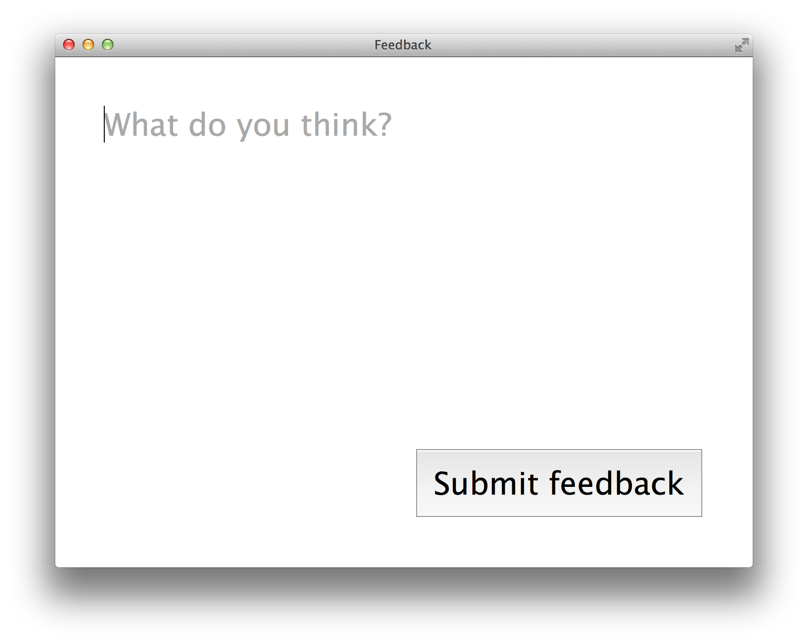

# collect-feedback

  Collect realtime anonymous feedback through a website.

  Useful for event hosts, speakers, teachers and more. Just hand out the address
  to your server and everyone can submit as much feedback as they like.



## Example

```bash
$ collect-feedback 3000
Mon Jun 30 2014 06:16:17  "sweet"
Mon Jun 30 2014 06:16:30  "this could be done\n\na lot better"
```

Open `http://localhost:3000/` in your browser to submit feedback, each entry will show up as a line on stdout.

The server makes no assumption about what you're going to do with the data, it's up to you to make sense of it.

## Tip: Use unix tools

You can for example pipe everything to a file, for later reference. But you also want to be notified about important feedback on the spot, so it would be helpful to see that on the screen:

```bash
$ collect-feedback | tee >(grep bor) >> feedback.txt
Mon Jun 30 2014 06:16:17  "I'm bored"
Mon Jun 30 2014 06:16:30  "Moove on please, I'm bored ;D"
```

## Usage

```bash
$ collect-feedback [PORT]
```

  Feedback is written to stdout, in columnar format.

## Installation

```bash
$ npm install -g collect-feedback
```

## License

  MIT

